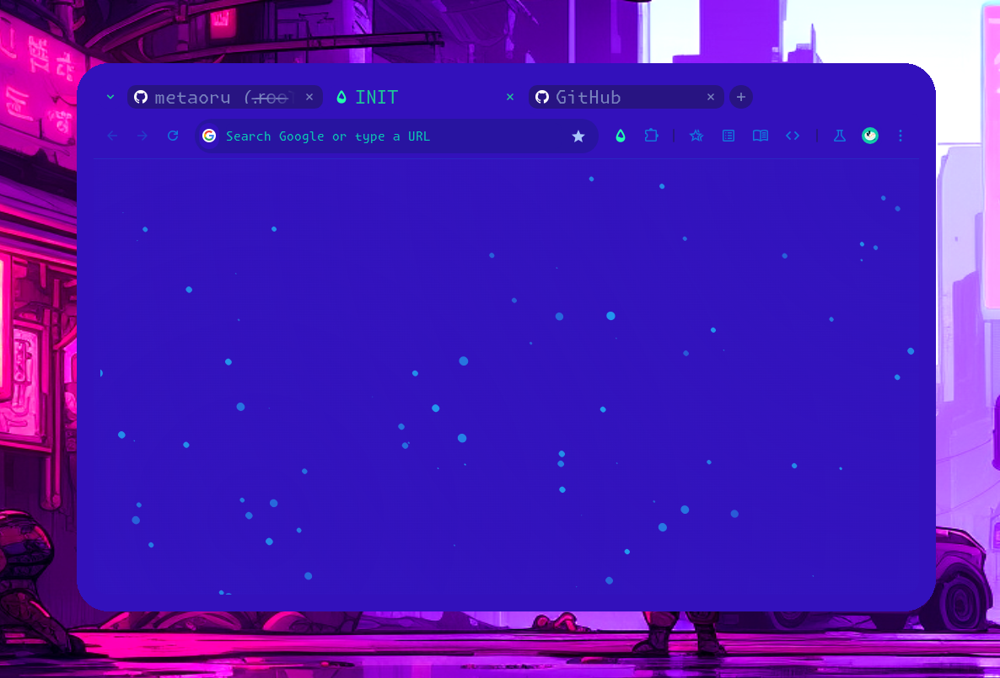

X-CRX
=====

  <h1>chrome://newtab</h1>
  
  <h5>Part of my personal extensions.</h5>

  

https://github.com/metaory/metaory.github.io/public/screencast.mp4

Used for `newtab` `chrome_url_overrides` [chrome://newtab](chrome://newtab)

> [developer.chrome.com/docs/extensions/develop/ui/override-chrome-pages](https://developer.chrome.com/docs/extensions/develop/ui/override-chrome-pages)

Hosted here for different purpose. [metaory.github.io](https://metaory.github.io)

